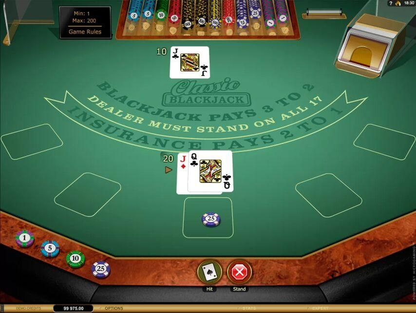
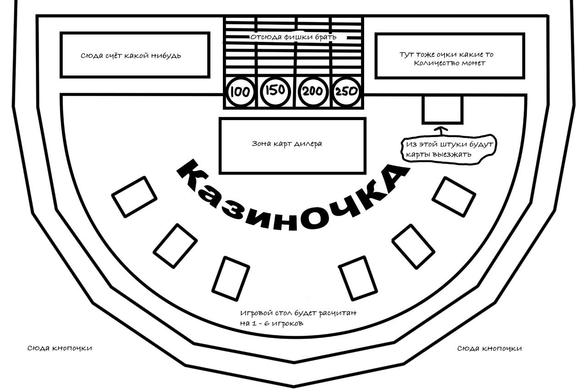
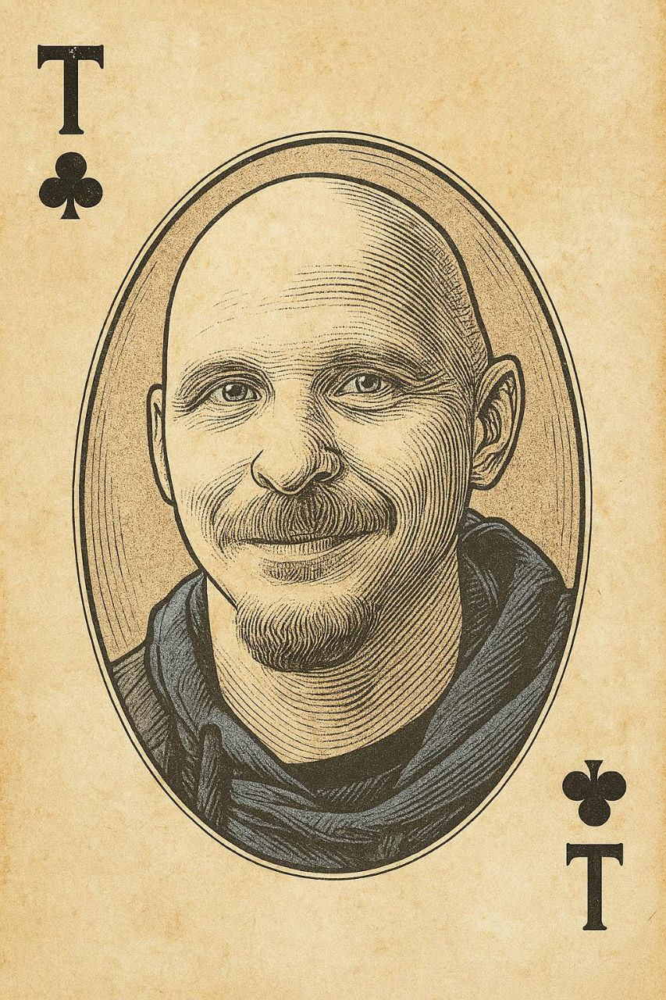

Игра КазинОЧКО

Игра представляет собой имитацию реального казино с классическими правилами блэкджека, где игроки соревнуются против компьютерного крупье, делая стратегические ставки и принимая решения в режиме реального времени. Правила игры определены в документе "Rules".

Содержание

1.Общая концепция	

    1.1.	Цели и задачи

    1.2.	Концепция

    1.3.	Целевая аудитория

    1.4.	Дальнейшее развитие и монетизация

2.Термины и определения

    2.1.	Основные термины

    2.2.	Игровые действия	

3.Описание сцены

    3.1.	Сцена аутентификации

    3.2.	Главное меню (лобби)	

    3.3.	Игровой стол

4.Игровые сценарии

    4.1.	Описание игрового процесса

    4.2.	Игровые сценарии

5.Примерный дизайн

    5.1.    Общий стиль

    5.2.    Игровой стол

    5.3.    Дизайн игровых карт

1.  Общая концепция

    1.1.	Цели и задачи

    Цель: Создать динамичную и социальную онлайн-версию игры "Blackjack" (далее Блэкджек) для игры на компьютере, которая сочетает в себе аутентичность казино с удобством цифрового формата. Игра должна предоставлять реалистичный игровой опыт с классическим интерфейсом игрового стола, разработанным для использования на персональных компьютерах.

    Задача: Создать веб-приложение для персональных компьютеров, которое комплексно реализует классический дизайн игрового стола казино с интуитивным управлением, компьютерного крупье, функционирующего согласно правилам, определенным в документе "Rules", систему приватных комнат для игры с друзьями, интеграцию виртуальной валюты с механикой пополнения через рекламу и таймеры для контроля времени принятия решений.

    1.2.	Концепция

    Приложение представляет собой браузерную платформу для игры в блэкджек, доступную исключительно на персональных компьютерах. Для доступа к полному функционалу пользователю требуется пройти процедуру регистрации и авторизации. Обязательным условием является наличие интернет-соединения.
    Игровой процесс строится по классическим правилам блэкджека, где участники играют против компьютерного крупье. Зарегистрированные пользователи получают доступ к системе виртуальной валюты, возможности создания приватных комнат и участия в многопользовательских сессиях.

    1.3.	Целевая аудитория

    Проект ориентирован на любителей карточных игр и ценителей атмосферы казино в возрасте 25-45 лет. Основную аудиторию составят игроки, ищущие подлинный опыт игры в блэкджек с тактической глубиной и возможностью общения. Важной частью аудитории станут поклонники многопользовательского формата, предпочитающие игру с друзьями в закрытых комнатах, а также игроки, ценящие быстрые сеансы игры без скачивания дополнительных приложений.

    1.4.	Дальнейшее развитие и монетизация

    Развитие проекта:

    *	Внедрение системы уровней и достижений для игроков
    *	Добавление различных вариантов правил (европейский, американский блэкджек)
    *	Разработка турнирной системы с еженедельными мероприятиями
    *	Добавление системы сезонных событий и тематического контента
    *	Интеграция рейтинговой системы и таблицы лидеров
    *	Реализация других игр в казино

    Монетизация:

    *	Премиум-подписка с ежедневными бонусами и эксклюзивным контентом
    *	Продажа виртуальной валюты за реальные деньги
    *	Покупка визуальных элементов (скины для карт, фишек, столов)
    *	Премиум-валюта для эксклюзивных предметов коллекционирования
    *	Платный доступ к турнирам с крупными призовыми фондами
    *	Система донатов для поддержки развития проекта

2.  Термины и определения

    2.1.	Основные термины

    Игрок - пользователь, сделавший ставку ≥100 кредитов и участвующий в текущем раунде.
    
    Зритель - пользователь, наблюдающий за игрой без права совершения игровых действий.

    Блэкджек — комбинация из двух карт: туза и любой карты стоимостью 10 очков (десятка, валет, дама, король). Дает наивысший выигрыш.

    Крупье — виртуальный ведущий игры, который раздает карты и действует по строго заданным правилам.

    Виртуальная валюта (Кредиты) — внутриигровые деньги, используемые для ставок.

    Игровой стол — виртуальное пространство, где происходит игра.

    Приватная комната — закрытый игровой стол, доступный по 4-значному коду.

    2.2.	Игровые действия - описаны в документе "Rules"

3.  Описание сцены

    3.1.	Сценарий аутентификации

    Экран входа: Поля для ввода логина и пароля, кнопка "Регистрация".

    Экран регистрации: Форма с обязательными полями (email, пароль, никнейм)

    3.2.	Главное меню (лобби)

    Центральная панель: Кнопки "Быстрая игра", "Приватная комната", "Таблица лидеров"

    Верхний правый угол: Текущий баланс кредитов

    3.3.	Игровой стол

    Центральная зона:

    *	Карты крупье (верхняя часть экрана)
    *	Игровое поле с разметкой ставок

    Игровые позиции: 6 мест по дуге, каждое включает:

    *	Область для карт игрока
    *	Поле текущей ставки
    *	Информацию об игроке (имя, ставка, баланс карт)

    Панель управления (вверху экрана):

    *	Кнопки действий: "Взять", "Остановиться" "Разделить"
    *	Кнопки изменения ставки: ±50, ×2, ÷2, поле ввода
    *	Таймер хода

4.  Игровые сценарии

    4.1.	Описание игрового процесса

    Пользователь запускает браузерную версию игры на персональном компьютере. После успешной регистрации в системе на баланс игрока автоматически зачисляются бонусные монеты. Игрок попадает в главное меню, где может создать новую комнату или присоединиться к существующей игровой сессии. 
    При выборе создания комнаты игрок мгновенно переносится за виртуальный игровой стол, где может начать игру против компьютерного крупье. Все параметры комнаты, включая минимальную ставку и лимит времени на принятие решений, установлены по умолчанию для максимально комфортного начала игры.
    Для игры с друзьями предусмотрена возможность использования 4-значного цифрового кода. Это позволяет быстро организовать приватную игровую сессию без необходимости сложных настроек.

    4.2.	Игровые сценарии

    Начало игры: 
    Пользователь запускает игру в браузере и видит стартовый экран авторизации. После ввода email и пароля система проверяет данные и при успешной аутентификации перенаправляет игрока в главное меню (лобби). Новым пользователям необходимо сначала зарегистрироваться, после чего система автоматически начисляет на их счет бонусные кредиты.

    Главное меню:
    Игрок попадает в лобби, где видит следующие варианты:
        * Быстрая игра - система автоматически находит свободную комнату с количеством игроков менее 6 и помещает пользователя в статусе "Зритель"
        * Приватная комната - открывает всплывающее окно с выбором "Создать приватную комнату" или "Присоединиться к приватной комнате"
        * Таблица лидеров - просмотр рейтинга игроков
        * В верхней части экрана отображается имя игрока и его текущий баланс с кнопкой "+" для пополнения счета через просмотр рекламных роликов.

    Быстрая игра:
    Система ищет комнату с игроками. При нахождении - вы становитесь зрителем. После ставки от 100 кредитов - игроком. Если свободных комнат нет - система создает новую, и вы начинаете игру.

    Приватная комната: При создании комнаты генерируется 4-значный код для приглашения друзей. При присоединении по коду система проверяет наличие свободных мест.

    Игровой процесс:
    После входа в комнату пользователь находится в статусе "Зритель". Для участия в игре необходимо сделать ставку не менее 100 кредитов, после чего статус автоматически меняется на "Игрок". Игровой процесс полностью соответствует документу "Rules", включая фазы ставок, принятия решений (Взять, Остановиться, Сплит) и ход дилера.

    Пополнение баланса:
    Игрок может в любой момент нажать кнопку "+" в главном меню для просмотра рекламного ролика. После полного просмотра на баланс начисляются кредиты. 

    Завершение игры:
    При выходе из комнаты через кнопку "←" с последующим подтверждением игрок возвращается в главное меню. Его текущий баланс сохраняется. При нажатии кнопки "Выйти" в боковом меню система разрывает сессию и перенаправляет на стартовый экран авторизации.

5.  Примерный дизайн

    5.1.    Общий стиль

    Дизайн игры отличается сдержанной цветовой палитрой и минималистичным подходом, что позволяет игроку полностью сосредоточиться на игровом процессе. Основные цвета: глубокий зеленый, темно-коричневый, золотые акценты.
    

    5.2.    Игровой стол

    Схема представляет собой прототип игрового стола, который может быть использован для дальнейшей разработки. Чистый и функциональный интерфейс со стандартной компоновкой: зона крупье вверху, 6 игровых позиций по дуге, панель управления расположена в нижних углах экрана.
    

    5.3.    Дизайн игровых карт
    
    Дизайн карт выполнен в стиле классической гравюры с элементами винтажной эстетики. Изображения нанесены с использованием техники перекрёстной штриховки, создающей эффект ручной работы. Такой подход придаёт картам уникальный и запоминающийся вид, соответствующий общему элегантному стилю игры.
    